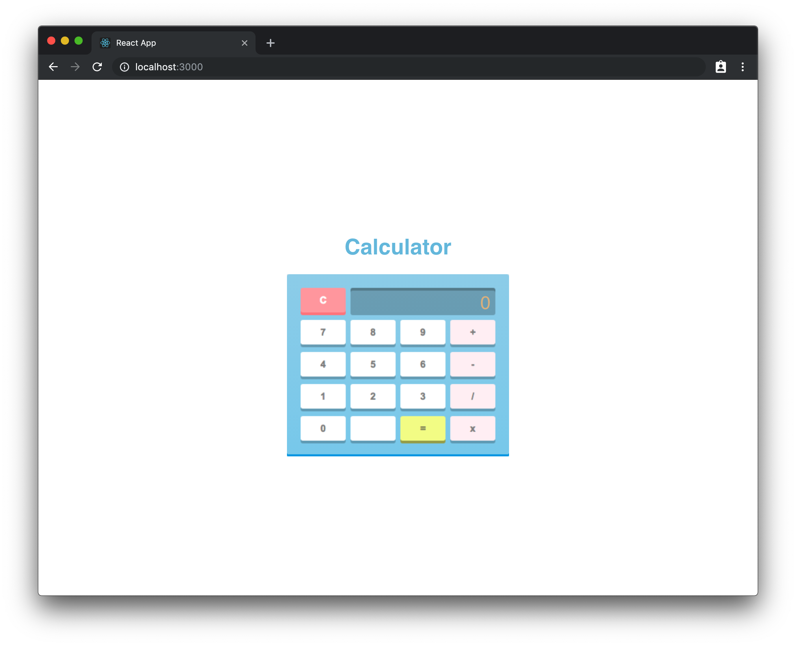

# Project Summary

In this project we will use an npm package called `create-react-app` to quickly spin up a react application.
We'll cover how to use `onClick` and `onChange` events in React, hooks, JSX, and how to import/export components.



## Setup

* `Fork` and `clone` this repository and then `cd` into it.
* Run `npx create-react-app app`in the root directory of this project. ( This will create a directory called app )
* Open the newly created `app` directory in your editor.
* Make sure to move the calculator.png image into the `app/src` directory so it can be properly loaded!

## Step 1

### Summary

In this step we will modify the first component `create-react-app` makes for us.

### Instructions

* Open `src/App.js`.
* Delete all the content in the App function and have it return `null`.
* Remove all content from `App.css` and paste in the solution. ( Found below )

<details>

<summary> <code> App.js </code> </summary>

```jsx
import React from 'react';
import logo from './logo.svg';
import './App.css';

function App() {
  return null;
}


export default App;
```

</details>

<details>

<summary> <code> App.css </code> </summary>

```css
body {
  margin: 0;
  padding: 0;
  font-family: sans-serif;
  display: flex;
  justify-content: center;
  align-items: center;
  width: 100%;
  height: 100vh;
}

.remove-highlight {
  user-select: none;
}

#calculator-container {
  height: 325px;
}

#calculator-mask {
  width: 325px;
  height: 267px;
  position: relative;
  top: -272px;
}

.btn {
  width: 66px;
  height: 40px;
  display: inline-block;
  position: absolute;
  cursor: pointer;
}

.output {
  position: absolute;
  width: 212px;
  height: 40px;
  top: 21px;
  left: 93px;
}

.total {
  position: absolute;
  right: 7px;
  bottom: 3px;
  font-size: 27px;
  color: burlywood;
}

.clear {
  left: 20px;
  bottom: 206px;
}

.zero {
  bottom: 18px;
  left: 20px;
}

.one {
  bottom: 65px;
  left: 20px;
}

.two {
  bottom: 65px;
  left: 93px;
}

.three {
  bottom: 65px;
  left: 166px;
}

.four {
  bottom: 112px;
  left: 20px;
}

.five {
  bottom: 112px;
  left: 93px;
}

.six {
  bottom: 112px;
  left: 166px;
}

.seven {
  bottom: 159px;
  left: 20px;
}

.eight {
  bottom: 159px;
  left: 93px;
}

.nine {
  bottom: 159px;
  left: 166px;
}

.decimal {
  bottom: 18px;
  left: 93px;
}

.equal {
  bottom: 18px;
  left: 166px;
}

.multiply {
  bottom: 18px;
  left: 239px;
}

.divide {
  bottom: 65px;
  left: 239px;
}

.subtract {
  bottom: 112px;
  left: 239px;
}

.add {
  bottom: 159px;
  left: 239px;
}

#header {
  text-align: center;
  color: #6ebfe0;
  min-height: 37px;
}

#header-input {
  width: 325px;
  position: absolute;
  height: 33px;
  background: transparent;
  border: none;
  color: transparent;
  outline: none;
}
```

</details>

## Step 2

### Summary

In this step we will create our `Calculator` component that will render in our calculator.

### Instructions


* Create a directory called `components` inside of the `src` directory. (`app/src`)
* Create a directory called `Calculator` inside of the `components` directory. ( `app/src/components` )
* Create a file called `Caclulator.js` inside of the `Calculator` directory you just created.
* Create a basic react function component called `Calculator` in the `Calculator.js` file you just created.
* Import the calculator image from the root directory. ( hint: `import varName from "picturepath.png"` )
  * name the imported image `calculatorImg`.
* Paste and return the following `JSX` layout inside the of the `Calculator` component. ( Found below )
  * <details>

    <summary> <code> JSX Layout </code> </summary>

    ```jsx
    return (
      <div id="calculator-container">
        <input id="header-input"/>
        <h1 id="header"> Calculator </h1>
        
        <div id="calculator-mask" className="remove-highlight">
          <div className="output">
            <span className="total"></span>
          </div>

          <div className="btn clear"></div>

          <div className="btn zero"></div>
          <div className="btn one"></div>
          <div className="btn two"></div>
          <div className="btn three"></div>
          <div className="btn four"></div>
          <div className="btn five"></div>
          <div className="btn six"></div>
          <div className="btn seven"></div>
          <div className="btn eight"></div>
          <div className="btn nine"></div>

          <div className="btn equal"></div>
          <div className="btn multiply"></div>
          <div className="btn divide"></div>
          <div className="btn subtract"></div>
          <div className="btn add"></div>
        </div>
      </div>
    )
    ```

    </details>
* Export default the calculator component at the bottom of `Calculator.js`.
* Import the calculator component in `App.js`.
* Add the calculator component in the return in `App.js`.
* Once you finish these steps run `npm start` (from the app directory) on the command line and you should see your calculator rendered on the screen.

### Solution

<details>

<summary> <code> Calculator.js </code> </summary>

```jsx
import React from 'react';
import calculatorImg from '../../../../calculator.png';

function Calculator() {
    return (
      <div id="calculator-container">
        <input id="header-input"/>
        <h1 id="header"> Calculator </h1>
        
        <div id="calculator-mask" className="remove-highlight">
          <div className="output">
            <span className="total"></span>
          </div>

          <div className="btn clear"></div>

          <div className="btn zero"></div>
          <div className="btn one"></div>
          <div className="btn two"></div>
          <div className="btn three"></div>
          <div className="btn four"></div>
          <div className="btn five"></div>
          <div className="btn six"></div>
          <div className="btn seven"></div>
          <div className="btn eight"></div>
          <div className="btn nine"></div>

          <div className="btn equal"></div>
          <div className="btn multiply"></div>
          <div className="btn divide"></div>
          <div className="btn subtract"></div>
          <div className="btn add"></div>
        </div>
      </div>
    )
}

export default Calculator;
```

</details>

<details>

<summary> <code> App.js </code> </summary>

```jsx
import React from 'react';
import './App.css';

import Calculator from './components/Calculator/Calculator';

function App() {
  return (
    <div>
      <Calculator />
    </div>
  );
}

export default App;
```

</details>

## Step 3

### Summary

In this step we'll make our calculator header editable by the user using the `useState` hook and an `onChange` event in `Calculator.js`.

Our header has two pieces : The visible text and an invisible input box.  We're going to wire up the header so that
when we click on it we can type in the invisible input box and the text part will update.

### Instructions

* Open `Calculator.js`. ( `src/components/Calculator/Calculator.js` )
* `import` the `useState` hook from React

  ```javascript
  import React, { useState } from 'react';
  ```
* Utilizing the `useState` hook, create a piece of state named `header`, inside of the Calculator component

  ```javascript
  const [header, setHeader] = useState();
  ```
* Add an `onChange` event to the input element with an id of `#header-input` and make its value be an arrow function that receives a parameter `e`. This parameter represents the changeEvent object.
* Inside the arrow function, call the `setHeader` function and pass in the value from the event: `e.target.value`.
* Inside the h1 element `#header`, change `Calculator` to the value of the `header` property on state.  ( hint: `{header}` )
* Test your header is working by clicking on it and typing in a new header.

### Solution

<details>

<summary> <code> Calculator.js </code> </summary>

```jsx
import React, { useState } from 'react';
import calculatorImg from '../../../../calculator.png';

function Calculator() {
  const [header, setHeader] = useState('Calculator');

  return (
    <div id="calculator-container">
      <input id="header-input" onChange={e => setHeader(e.target.value)}/>
      <h1 id="header"> {header} </h1>
      
      <div id="calculator-mask" className="remove-highlight">

        <div className="output">
          <span className="total"></span>
        </div>

        <div className="btn clear"></div>

        <div className="btn zero"></div>
        <div className="btn one"></div>
        <div className="btn two"></div>
        <div className="btn three"></div>
        <div className="btn four"></div>
        <div className="btn five"></div>
        <div className="btn six"></div>
        <div className="btn seven"></div>
        <div className="btn eight"></div>
        <div className="btn nine"></div>

        <div className="btn equal"></div>
        <div className="btn multiply"></div>
        <div className="btn divide"></div>
        <div className="btn subtract"></div>
        <div className="btn add"></div>
      </div>
    </div>
  )
}

export default Calculator;
```

</details>

<br />

You should now be able to click on the header and type in a new value for it.

## Step 4

### Summary

In this step we will assign variables to state which we will need to keep track of information during run time.

### Instructions

* Open `Calculator.js` ( `src/components/Calculator/Calculator.js` )
* Add a piece of state named display `display` using the `useState` hook with an initial value of `'0'`
* Add a piece of state named display `operator` using the `useState` hook with an initial value of `''`
* Add a piece of state named display `temp` using the `useState` hook with an initial value of `0`
* Add a piece of state named display `reset` using the `useState` hook with an initial value of `false`

Notice how `display` is a String and `temp` is an Integer.

#### Solution

<details>

<summary> <code> useState definitions </code> </summary>

```jsx
// calculator state
const [display, setDisplay] = useState(0);
const [operator, setOperator] = useState('');
const [temp, setTemp] = useState(0);
const [reset, setReset] = useState(false);
```

</details>

## Step 5

### Summary

In this step we will add event handlers that that will allow us to click on the number
buttons and see the number appear in the display of the calculator.

### Instructions

* Open `Calculator.js`. ( `src/components/Calculator/Calculator.js` )
* Change the value of the span with the class of `.total` to the value of the `display` property on state. ( hint: `{display}` )
* Update buttons `zero` through `nine` with `onClick` handlers that call the `setDisplay` function
  with the correct number in **string** format. You can tell which button is which number by its `className`.

### Solution

<details>

<summary> <code> Calculator.js </code> </summary>

```jsx
function Calculator() {
  const [header, setHeader] = useState('Calculator');

  // calculator state
  const [display, setDisplay] = useState('0');
  const [operator, setOperator] = useState('');
  const [temp, setTemp] = useState(0);
  const [reset, setReset] = useState(false);

  return (
    <div id="calculator-container">
      <input id="header-input" onChange={e => setHeader(e.target.value)} />
      <h1 id="header">{header}</h1>
      
      <div id="calculator-mask" className="remove-highlight">
        <div className="output">
          <span className="total">{display}</span>
        </div>

        <div className="btn clear" />

        <div className="btn zero" onClick={() => setDisplay(display + '0')} />
        <div className="btn one" onClick={() => setDisplay(display + '1')} />
        <div className="btn two" onClick={() => setDisplay(display + '2')} />
        <div className="btn three" onClick={() => setDisplay(display + '3')} />
        <div className="btn four" onClick={() => setDisplay(display + '4')} />
        <div className="btn five" onClick={() => setDisplay(display + '5')} />
        <div className="btn six" onClick={() => setDisplay(display + '6')} />
        <div className="btn seven" onClick={() => setDisplay(display + '7')} />
        <div className="btn eight" onClick={() => setDisplay(display + '8')} />
        <div className="btn nine" onClick={() => setDisplay(display + '9')} />

        <div className="btn equal" />
        <div className="btn multiply" />
        <div className="btn divide" />
        <div className="btn subtract" />
        <div className="btn add" />
      </div>
    </div>
  );
}
```

</details>

## Step 6

### Summary

In this step we will be tweaking our calculator to handle certain display scenarios.
If we click on our buttons we can see that our display now updates.
However our calculator keeps the initial 0 and also doesn't account for length and can break out of its container.

### Instructions

* Open `Calculator.js`. ( `src/components/Calculator/Calculator.js` )
* Create a new function below the state hooks called `normalizeDisplay`
  * The `normalizeDisplay` function will accept a `num` parameter
  * If `display` is currently equal to `'0'` then `display` should be set to `num`
  * Otherwise the next display state should be `display + num`
  * The `display` value should only change if it's currently shorter than 13 characters


* Create a variable called `display` inside the `setDisplay` method.
* Assign the new variable `display` a value:
  * If `this.state.display` is `"0"` then `display` should equal `num`
  * Otherwise `display` should equal `this.state.display` + `num`
* Modify `this.setState` to update display:
  * If `this.state.display` is less than 13 characters then update with the new `display` variable.
  * Otherwise update with the current value of `this.state.display`.

### Solution

<details>

<summary> <code> normalizeDisplay function </code> </summary>

```jsx
const normalizeDisplay = num => {
  const nextDisplay = display === '0' ? num : display + num;
  if (display.length < 13) setDisplay(nextDisplay);
};
```

</details>

### Solution

## Step 7

### Summary

In this step will be adding a `selectOperator` function that will handle setting our math operator using an `operator` parameter.

### Instructions

* Open `Calculator.js`. ( `src/components/Calcualtor/Calculator.js` )
* Create a function called `selectOperator` that takes a parameter called `selected`.
* Update the operator `div` elements to call the `selectOperator` method with the correct operator.
* You can tell which `div` elements are operators by their class name.
  * Use "+" for addition
  * Use "-" for subtraction
  * Use "/" for division
  * Use "*" for multiplication
* Add an if statement at the beginning of the `selectOperator` method that checks if the operator has not been set.
  ( hint: look at the defualt value for `operator` )
* Update the `operator`, `temp`, and `display` state in the if statement in the `selectOperator` method.
  * `temp` should equal the current `display` state parsed to an integer.
  * `display` should then be set to "0".
  * `operator` should equal the value of the `selected` parameter.

### Solution

<details>

<summary> <code> selectOperator function </code> </summary>

```jsx
const selectOperator = (selected) => {
  if (!operator) {
    setTemp(parseInt(display));
    setDisplay('0');
    setOperator(selected);
  }
}

// JSX in return of Calculator.js
<div className="btn multiply" onClick={() => this.selectOperator('*')}></div>
<div className="btn divide"   onClick={() => this.selectOperator('/')}></div>
<div className="btn subtract" onClick={() => this.selectOperator('-')}></div>
<div className="btn add"      onClick={() => this.selectOperator('+')}></div>
```

</details>

## Step 8

### Summary

In this step we will be adding a calculate method that will perform the selected operation.

### Instructions

* Open `Calculator.js`. ( `src/components/Calculator/Calculator.js` )
* Create a `calculate` function.
* Update the `.btn equal` element to call the `calculate` method.
* Add an if statement at the beginning of the `calculate` method that calls `return;` if the operator hasn't been set yet.
* Create a `switch` statement with the the `operator` state value , based on it's value ( "+", "-", "/", "*" )
  perform the correct operation and set the result to the value
* Update the display property on state with `result` after the switch statement.

### Solution

<details>

<summary> <code> calculate function </code> </summary>

```jsx
const calculate = () => {
  if (!operator) return;
  let result;

  switch (operator) {
    case '+':
      result = temp + parseInt(display, 10);
      break;
    case '-':
      result = temp - parseInt(display, 10);
      break;
    case '*':
      result = temp * parseInt(display, 10);
      break;
    case '/':
      result = temp / parseInt(display, 10);
      break;
    default:
      break;
  }

  setDisplay(result.toString());
};
```

</details>

## Step 9

### Summary

In this step we will be making the clear button work.

### Instructions

* Open `Calculator.js`. ( `src/components/Calculator/Calculator.js` )
* Create a `clearDisplay` method.
* Update the `.btn clear` element to call the `clearDisplay` method.
* In the `clearDisplay` method use `setState` to reset the properties on state to their default values.

### Solution

<details>

<summary> <code> clearDisplay method </code> </summary>

```jsx
const clearDisplay = () => {
  setDisplay('0');
  setTemp(0);
  setOperator('');
  setReset(false);
}
```

</details>

<br />

## Black Diamond

### Instructions

Figure out how to use the `resetDisplay` state property so that the user can start doing other math operations when clicking on a number after pressing equals.
